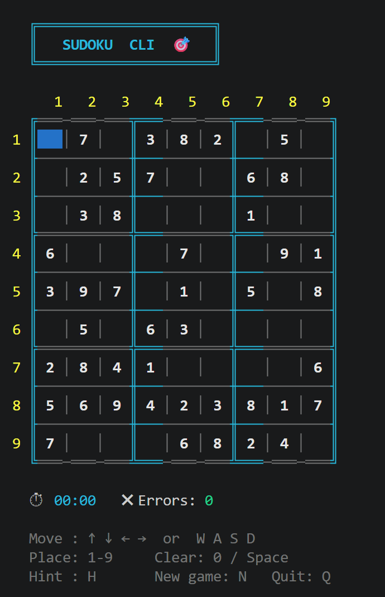

# 🎯 Sudoku CLI

A fully-featured, colourful Sudoku game that runs right in your terminal — no browser, no dependencies, just Python.



---

## ✨ Features

- 🎨 **Colour-coded display** — fixed clues in white, your entries in green, mistakes highlighted in red
- 🟦 **Visual cursor** — blue-highlighted active cell for easy navigation
- 📦 **Distinct 3×3 box borders** — cyan bold lines separate boxes from thin inner grid lines
- ⏱ **Live timer** — tracks your solving time
- ❌ **Error counter** — real-time count of incorrect placements
- 💡 **Hint system** — stuck? Press `H` to reveal the correct digit for the current cell
- 🎚 **3 difficulty levels** — Easy, Medium, and Hard
- 🔄 **Instant new game** — press `N` anytime to start fresh
- 🖥 **Cross-platform** — works on Linux, macOS, and Windows

---

## 🚀 Getting Started

### Prerequisites

- Python 3.6 or higher
- A terminal that supports ANSI colour codes (most modern terminals do)

### Run the game

```bash
# Clone the repo
git clone https://github.com/Mayukh-Jain/Sudoku-CLI.git
cd Sudoku-CLI

# Play!
python3 main.py
```

No `pip install` needed — the game uses only Python's standard library.

---

## 🕹 Controls

| Key | Action |
|-----|--------|
| `↑` `↓` `←` `→` or `W` `A` `S` `D` | Move cursor |
| `1` – `9` | Place a digit |
| `0` or `Space` | Clear the current cell |
| `H` | Hint — reveal the correct digit for this cell |
| `N` | Start a new game |
| `Q` or `Ctrl+C` | Quit |

---

## 🎚 Difficulty Levels

| Level  | Cells Removed | Description |
|--------|:---:|-------------|
| Easy   | 36 | Plenty of givens to guide you |
| Medium | 46 | A balanced challenge |
| Hard   | 54 | Minimal clues — for experts |

---

## 🗂 Project Structure

```
sudoku-cli/
├── main.py     # The entire game — single file, no dependencies
└── README.md
```

---

## 🛠 How It Works

1. **Puzzle generation** — a complete valid board is built using a randomised backtracking solver, then cells are removed according to the chosen difficulty.
2. **Validation** — every entry is checked against the solution in real time; errors are highlighted immediately without blocking progress.
3. **Rendering** — the board is redrawn on each keypress using ANSI escape codes for colour and a `clear()` call to avoid flicker.

---

## 📋 Roadmap

- [ ] Pencil / candidate notes mode
- [ ] High-score leaderboard (saved locally)
- [ ] Undo / redo support
- [ ] Load puzzle from file or string
- [ ] Colour theme selection

---

## 🙌 Contributing

Pull requests are welcome! Feel free to open an issue for bugs, feature requests, or ideas.

1. Fork the repo
2. Create a branch: `git checkout -b feature/my-feature`
3. Commit your changes: `git commit -m "Add my feature"`
4. Push: `git push origin feature/my-feature`
5. Open a Pull Request
